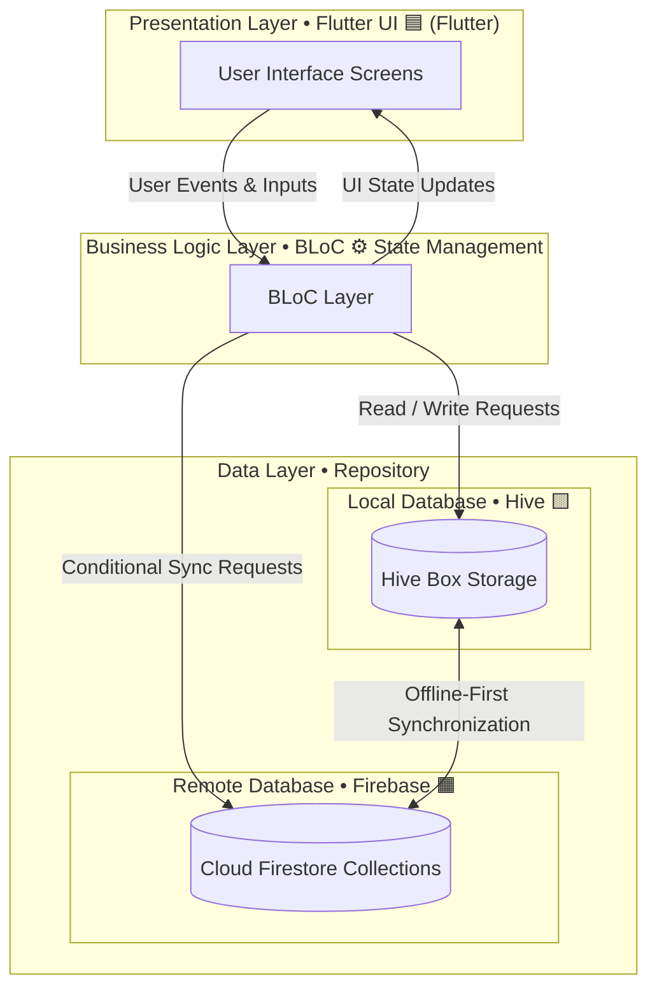

# 🍱 TiffinMate

[](/doc/demo.mp4)

> **A lightweight, offline-first Flutter application to track daily tiffin meals, calculate bills, and manage mess expenses.**

**TiffinMate** is designed for students and professionals living in hostels or PGs who rely on tiffin services. It solves the common problem of tracking daily meals ("Did I eat lunch on Tuesday?") and calculating monthly bills accurately, all wrapped in a modern, animated user interface.

---

## 🚀 Executive Summary

- **Goal**: Simplify tiffin tracking with smart automation and offline capabilities.
- **Target Audience**: Hostel/PG residents, students, and working professionals.
- **Key Value**: Never lose track of a meal or overpay your tiffin provider again.

---

## ✨ Core Features

### 🏠 Dashboard (The Home)

- **Smart "Add Tiffin" Action**:
  - **Auto-Detection**: Intelligently tags meals based on time (10 AM - 5 PM: Lunch ☀️, 6 PM - 9 PM: Dinner 🌙).
  - **Quick Add**: One-tap logging for your default meal price.
  - **Manual Override**: Easily change tags if you're eating late.
- **Weekly Snapshot**: A sleek card displaying your "Current Week's Total" and "Tiffins Consumed" at a glance.

### 📅 Calendar & History

- **Visual Tracking**: A calendar view with color-coded dots (🟢 Lunch, 🔵 Dinner) to visualize your monthly habits.
- **Edit History**: Tap any past date to add missed entries or fix mistakes.

### 💰 Smart Billing System

- **Flexible Ranges**: Calculate bills for "This Week", "Last Month", or any **Custom Date Range**.
- **Detailed Breakdown**: View a clear table of Date | Type | Price.
- **Grand Total**: Bold, clear display of the final amount to pay.

### 👤 Profile & Settings

- **Default Price**: Set your standard meal cost (e.g., ₹80) to auto-populate new entries.
- **Sync Status**: Real-time indicator showing if your local data is backed up to the cloud.

---

## 🌟 Enhanced UX Features (Pro)

- **🚫 Skip Marking**: Explicitly mark meals as "Skipped" to distinguish between "forgot to enter" and "didn't eat".
- **💸 Payment Tracking**: Mark bills as **PAID** and keep a history to avoid confusion with your provider.
- **📤 PDF/Image Export**: Generate professional bill summaries to share via WhatsApp.
- **🔔 Smart Reminders**: Get nudged at 2 PM and 9 PM: _"Did you have your tiffin? Tap to log."_
- **📈 Analytics**: Visualize your expense trends with simple "This Month vs Last Month" charts.

---

## 🎨 UI/UX Design System

- **Theme**: Modern Minimalist with full **Dark Mode** support.
- **Palette**:
  - **Primary**: Delicious Orange/Coral 🧡 (Evokes hunger/warmth).
  - **Secondary**: Soft Teal 💚 (For financial/success states).
  - **Background**: Clean Off-white / Deep Grey.
- **Animations**:
  - **Hero Animations**: Smooth transitions when expanding details.
  - **Confetti**: Celebrate when a bill is marked as "Paid" 🎉.
  - **Slide-to-Delete**: Intuitive gestures for management.

---

## 🧱 System Architecture


---

## 🗺 Mermaid Architecture Diagram



---

## 🛠️ Tech Stack

| Component            | Technology                                                                                                   | Description                       |
| :------------------- | :----------------------------------------------------------------------------------------------------------- | :-------------------------------- |
| **Framework**        |               | Cross-platform native performance |
| **Language**         |                        | Optimized for UI development      |
| **Backend (BaaS)**   |            | Auth & Cloud Firestore            |
| **Local DB**         |                        | Fast, offline-first NoSQL storage |
| **State Management** |                        | Predictable state & sync logic    |
| **UI Library**       |  | Latest Android design standards   |

---

## ⚙️ Setup & Installation

### Prerequisites

- 🐦 Flutter SDK (3.0+)
- 🔑 Firebase Project (with Firestore & Auth enabled)

### 🚀 Quick Start

1.  **Clone the repository**

    ```bash
    git clone https://github.com/sanket-pilane/TiffinMate.git
    cd TiffinMate
    ```

2.  **Install dependencies**

    ```bash
    flutter pub get
    ```

3.  **Firebase Configuration**

    - Download `google-services.json` (Android) and `GoogleService-Info.plist` (iOS) from your Firebase Console.
    - Place them in `android/app/` and `ios/Runner/` respectively.

4.  **Run the App**
    ```bash
    flutter run
    ```

---

## 🤝 Git Workflow

| Branch      | Purpose                                              |
| :---------- | :--------------------------------------------------- |
| `main`      | 🛡️ Production ready code.                            |
| `develop`   | 🚧 Integration branch for testing.                   |
| `feature/*` | ✨ Feature branches (e.g., `feature/smart-billing`). |

Happy Coding! ❤️
